<p align="center">
  
</p>

# OmniGraph-RAG

**A next-generation, dynamically adaptive GraphRAG system**  
for mapping, querying, and reasoning over the landscape of Disruptive Innovation.

[](https://python.org)
[](https://neo4j.com)
[](https://ollama.com)
[](https://langchain.com/langgraph)
[](https://fastapi.tiangolo.com)
[](LICENSE)

*Built with 🇲🇦 by **Kawtar Labzae***

</div>

---

## What is OmniGraph-RAG?

Standard RAG systems treat every question the same: embed → retrieve top-K chunks → generate. That is a blunt instrument. **OmniGraph-RAG** is a scalpel.

It pioneers a new architectural pattern — **OmniGraph** — that fuses three distinct paradigms into a single, self-adapting retrieval pipeline:

| Paradigm | Role | Mechanism |
|---|---|---|
| **PolyG Query Planning** | The brain | Classifies every query into a strict taxonomy and selects the exact graph traversal strategy |
| **DRIFT Search** | The engine | Multi-hop iterative retrieval: starts global (community summaries), drills local (node connections), loops until confidence is met |
| **Neo4j Backbone** | The memory | Native Cypher queries, HNSW vector indexes, hybrid structural + semantic search |

The result: a system that answers a simple factual question in one Cypher hop, and a complex multi-causal reasoning question through six iterative DRIFT loops — automatically, with no configuration changes between them.

---

## The PolyG Taxonomy

Every query that enters OmniGraph is classified into one of four archetypes before a single database call is made.

```
USER QUERY
    │
    ▼
┌─────────────────────────────────────────────────────────┐
│                   PolyG Classifier                      │
│            (Ollama LLM · structured output)             │
└───────┬──────────────┬──────────────┬───────────────────┘
        │              │              │              │
        ▼              ▼              ▼              ▼
  SUBJECT_       OBJECT_       FACT_          NESTED
  CENTERED       DISCOVERY     CHECKING
        │              │              │              │
  Vector KNN     BFS Graph      Cypher        DRIFT
  + 1-hop        Expansion      Exact Match   Engine ↺
  expansion      (APOC)         → vector      (iterative)
                               fallback
        │              │              │              │
        └──────────────┴──────────────┴──────────────┘
                                │
                        assemble_context
                                │
                        LLM Synthesis
                     (Ollama · Llama 3)
                                │
                        Grounded Answer
                       with Graph Citations
```

### The four archetypes, precisely defined

**`SUBJECT_CENTERED`** — The query names a specific entity and asks about its properties, attributes, or state.
> *"What is the Lean Startup methodology?"* — anchors on the `Lean Startup` node, expands 1-hop.

**`OBJECT_DISCOVERY`** — The query asks for a *set* of entities satisfying a structural or relational condition.
> *"Which frameworks are used in agile project management?"* — BFS expansion from agile seed nodes.

**`FACT_CHECKING`** — The query implies a specific (subject → predicate → object) triple to verify.
> *"Is Six Sigma related to quality management?"* — O(1) Cypher exact match, vector fallback on miss.

**`NESTED`** — The query requires chained reasoning across multiple entities, relationships, or temporal states. Cannot be resolved in a single graph hop.
> *"How did Toyota's philosophy influence Silicon Valley startups, and what modern frameworks trace their lineage to it?"* — triggers the DRIFT engine.

---

## The DRIFT Engine

DRIFT (Dynamic Reasoning & Inference for Traversal) is the core innovation of this system. It solves the fundamental limitation of single-pass RAG: **you don't know what you don't know until you start looking**.

```
                    ┌──────────────────────┐
  Original Query ──►│  1. Global Map Pass  │  Fetch top-K community
                    │  (Community Nodes)   │  summaries via vector KNN
                    └──────────┬───────────┘
                               │
                    ┌──────────▼───────────┐
                    │  2. Sub-query        │  LLM formulates focused
                    │     Formulation      │  follow-up queries from
                    │  (Ollama LLM)        │  the community context
                    └──────────┬───────────┘
                               │
                    ┌──────────▼───────────┐
                    │  3. Local Drill-Down │  Execute sub-queries
                    │  (Neo4j HNSW KNN)    │  against entity nodes
                    └──────────┬───────────┘
                               │
                    ┌──────────▼───────────┐
                    │  4. Context          │  Compute information gain
                    │     Evaluation       │  (Jaccard novelty score)
                    └──────────┬───────────┘
                               │
              ┌────────────────▼───────────────────┐
              │  Confidence ≥ 0.72 ?               │
              │  OR  Info gain < 0.05 ?            │
              │  OR  Iterations ≥ 6 ?              │
              └────────────────┬───────────────────┘
                        No ◄───┘  Yes
                        ▲          │
                        └──────────┘          ┌──────────────────┐
                    (loop back)                │  5. RRF Re-rank  │
                                               │  & Merge Context │
                                               └──────────────────┘
```

**Stop conditions** (whichever fires first):
- Cumulative confidence score ≥ `0.72` (context is rich enough)
- Marginal information gain < `0.05` (diminishing returns)
- Maximum iterations reached (`6` by default)

**Re-ranking** uses **Reciprocal Rank Fusion (RRF)** — a parameter-free algorithm that outperforms score averaging when sources have different score distributions (Cormack et al., 2009).

---

## System Architecture

```
omniograph_rag/
│
├── api/                        # FastAPI layer
│   ├── main.py                 # Lifespan hooks, app factory
│   ├── routes/
│   │   ├── query.py            # POST /query  •  POST /query/stream (SSE)
│   │   └── admin.py            # GET  /admin/health
│   └── middleware/
│       └── tracing.py          # X-Trace-Id header injection
│
├── routing/                    # PolyG intelligence layer
│   ├── classifier.py           # Ollama LLM → structured ClassificationResult
│   ├── router.py               # LangGraph nodes + conditional edge function
│   └── taxonomy.py             # QueryType enum + Pydantic models
│
├── drift/
│   └── engine.py               # Full DRIFT iterative loop + RRF re-ranker
│
├── retrieval/                  # One handler per taxonomy type
│   ├── local_search.py         # SUBJECT_CENTERED  → HNSW KNN + 1-hop
│   ├── graph_expansion.py      # OBJECT_DISCOVERY  → APOC BFS
│   └── fact_verifier.py        # FACT_CHECKING     → Cypher exact + fallback
│
├── synthesis/
│   ├── prompt_builder.py       # Token-budget-aware context assembly
│   └── generator.py            # Ollama synthesis with citation grounding
│
├── graph/
│   ├── driver.py               # Neo4j AsyncDriver singleton + pool management
│   ├── indexes.py              # HNSW vector index bootstrap (idempotent)
│   └── queries/                # Raw Cypher files (versioned separately)
│       ├── local_vector.cypher
│       ├── graph_expand.cypher
│       ├── triple_verify.cypher
│       └── community_map.cypher
│
├── pipeline/
│   └── graph.py                # LangGraph StateGraph — full wiring
│
├── core/
   ├── state.py                # OmniGraphState TypedDict (shared pipeline state)
   ├── config.py               # Pydantic Settings (all env vars, type-safe)
   └── exceptions.py           # Custom exception hierarchy

```

---

## Tech Stack

| Component | Technology | Why |
|---|---|---|
| **Local LLM** | Ollama + Llama 3 (8B / 70B) | 100% local, no API cost, GPU-accelerated on CUDA |
| **Embeddings** | `nomic-embed-text` via Ollama | High-quality, local, 768-dim embeddings |
| **Graph DB** | Neo4j 5.x | Native HNSW vector index, APOC BFS, Cypher |
| **Orchestration** | LangGraph 0.2+ | Typed state, conditional edges, async streaming |
| **API** | FastAPI + Uvicorn | Async-native, SSE streaming, OpenAPI docs |
| **Config** | Pydantic Settings | Type-safe env vars, `.env` file support |
| **Caching** | Redis (optional) | Classifier result cache, ~35–55% hit rate |

---

## Getting Started

### Prerequisites

- Ubuntu 22.04+ (or WSL2 on Windows)
- Python 3.10+
- Neo4j 5.x (Community or Enterprise)
- Ollama installed and running
- NVIDIA GPU recommended (MX250+ / RTX series for best performance)

### 1. Install Ollama and pull models

```bash
# Install Ollama
curl -fsSL https://ollama.com/install.sh | sh

# Pull the models used by OmniGraph
ollama pull llama3          # Main reasoning model (8B)
ollama pull nomic-embed-text # Embedding model

# Verify Ollama is running
ollama serve &
curl http://localhost:11434/api/tags
```

### 2. Set up Neo4j

```bash
# Docker (easiest)
docker run \
  --name neo4j-omni \
  -p 7474:7474 -p 7687:7687 \
  -e NEO4J_AUTH=neo4j/your_password \
  -e NEO4JLABS_PLUGINS='["apoc", "graph-data-science"]' \
  neo4j:5.20-community
```

### 3. Clone and configure

```bash
git clone https://github.com/kawtar-labzae/OmniGraph-RAG.git
cd OmniGraph-RAG

# Create virtual environment
python -m venv .venv && source .venv/bin/activate

# Install dependencies
pip install -e ".[dev]"
```

Create your `.env` file:

```env
# ── Neo4j ──────────────────────────────────────────────
NEO4J_URI=bolt://localhost:7687
NEO4J_USER=neo4j
NEO4J_PASSWORD=your_password
NEO4J_DATABASE=neo4j

# ── Ollama (local LLM — no API key needed!) ────────────
OLLAMA_BASE_URL=http://localhost:11434
CLASSIFIER_MODEL=llama3
SYNTHESIS_MODEL=llama3
EMBEDDING_MODEL=nomic-embed-text
EMBEDDING_DIMENSIONS=768

# ── DRIFT tuning ───────────────────────────────────────
DRIFT_MAX_ITERATIONS=3
DRIFT_CONFIDENCE_FLOOR=0.72
DRIFT_MIN_INFO_GAIN=0.05

# ── API ────────────────────────────────────────────────
API_HOST=0.0.0.0
API_PORT=8000
LOG_LEVEL=INFO

# ── Optional: Redis classifier cache ──────────────────
REDIS_URL=redis://localhost:6379/0
```

### 4. Launch

```bash
# Start the API (bootstraps Neo4j indexes on startup)
uvicorn api.main:app --host 0.0.0.0 --port 8000 --reload

# ✅ You should see:
# INFO | Neo4j driver ready (pool_size=50)
# INFO | Vector indexes bootstrapped.
# INFO | OmniGraph-RAG pipeline compiled successfully.
# INFO | OmniGraph-RAG ready on 0.0.0.0:8000
```

Open **http://localhost:8000/docs** for the interactive API explorer.

---

## Using OmniGraph

### Query endpoint

```bash
# Subject-Centered query → fast local vector search
curl -X POST http://localhost:8000/query \
  -H "Content-Type: application/json" \
  -d '{"query": "What is the Lean Startup methodology?"}'
```

```json
{
  "trace_id": "a3f8c2d1-...",
  "query_type": "SUBJECT_CENTERED",
  "classifier_confidence": 0.95,
  "final_answer": "The Lean Startup methodology, developed by Eric Ries, is...\n[Source: Lean Startup] [Source: Eric Ries]",
  "citations": ["4:abc123", "4:def456"],
  "latency_ms": {
    "classify": 312.4,
    "local_vector": 48.2,
    "assemble_context": 5.1,
    "synthesis": 1840.7
  },
  "drift_iterations": 0
}
```

```bash
# Nested query → triggers full DRIFT engine
curl -X POST http://localhost:8000/query \
  -H "Content-Type: application/json" \
  -d '{
    "query": "How did Toyota'\''s innovation philosophy influence Silicon Valley startups, and what modern frameworks trace their lineage to it?"
  }'
```

```json
{
  "trace_id": "b7e1d9f2-...",
  "query_type": "NESTED",
  "classifier_confidence": 0.91,
  "final_answer": "Toyota'\''s production philosophy, particularly the Toyota Production System (TPS)...",
  "citations": ["4:node_001", "4:node_034", "4:node_089"],
  "latency_ms": {
    "classify": 298.1,
    "drift": 12430.5,
    "assemble_context": 18.3,
    "synthesis": 3210.9
  },
  "drift_iterations": 4
}
```

### Streaming endpoint (recommended for UIs)

```bash
# Returns Server-Sent Events — see each pipeline node fire in real-time
curl -N -X POST http://localhost:8000/query/stream \
  -H "Content-Type: application/json" \
  -d '{"query": "List all frameworks that support disruptive innovation."}'

# Output stream:
# data: {"node": "classify_query",         "data": {"query_type": "OBJECT_DISCOVERY", ...}}
# data: {"node": "graph_expansion_search", "data": {"latency_ms": {...}}}
# data: {"node": "assemble_context",       "data": {"citations": [...]}}
# data: {"node": "generate_answer",        "data": {"latency_ms": {...}}}
# data: {"event": "done"}
```

### Health check

```bash
curl http://localhost:8000/admin/health

{
  "status": "ok",
  "neo4j_connected": true,
  "node_count": 4821,
  "relationship_count": 18304,
  "vector_index_ready": true
}
```

---

## Ollama Integration Notes

OmniGraph ships with OpenAI-compatible defaults but is designed to run entirely locally with Ollama. Here is the adapter pattern used:

```python
# core/config.py — Ollama replaces OpenAI everywhere
OLLAMA_BASE_URL = "http://localhost:11434"
CLASSIFIER_MODEL = "llama3"      # PolyG classifier
SYNTHESIS_MODEL  = "llama3"      # Answer generation
EMBEDDING_MODEL  = "nomic-embed-text"  # Vector embeddings
```

```python
# In classifier.py and generator.py — LangChain Ollama adapter
from langchain_ollama import ChatOllama, OllamaEmbeddings

llm = ChatOllama(
    model=settings.classifier_model,
    base_url=settings.ollama_base_url,
    temperature=0.0,
    format="json",   # Enforces structured output for the classifier
)

embedder = OllamaEmbeddings(
    model=settings.embedding_model,
    base_url=settings.ollama_base_url,
)
```

> **GPU tip:** On an MX250 (2GB VRAM), run Llama 3 8B in Q4 quantisation:
> ```bash
> ollama pull llama3:8b-instruct-q4_K_M
> ```
> This fits comfortably in 2GB VRAM while maintaining strong reasoning quality.

---

```

---

## Seeding Your Knowledge Graph

OmniGraph is only as powerful as the data in your Neo4j instance. Here is a minimal Cypher script to import a starter set of innovation concepts and get real results immediately:

```cypher
// Create core innovation concepts
CREATE (:Entity:Framework {
  name: "Lean Startup",
  description: "An iterative methodology for building businesses and products. Popularised by Eric Ries in 2011.",
  domain: "Innovation Management",
  year: 2011
})

CREATE (:Entity:Person {
  name: "Eric Ries",
  role: "Author, Entrepreneur",
  nationality: "American"
})

CREATE (:Entity:Framework {
  name: "Design Thinking",
  description: "A human-centered approach to innovation developed at IDEO and Stanford d.school.",
  domain: "Product Innovation",
  year: 1991
})

CREATE (:Entity:Concept {
  name: "Disruptive Innovation",
  description: "Theory coined by Clayton Christensen. Describes how smaller companies challenge incumbents.",
  domain: "Innovation Theory",
  year: 1995
})

CREATE (:Entity:Person {
  name: "Clayton Christensen",
  role: "Professor, Harvard Business School",
  nationality: "American"
})

// Relationships
MATCH (e:Entity {name: "Eric Ries"}), (f:Entity {name: "Lean Startup"})
CREATE (e)-[:DEVELOPED]->(f)

MATCH (f:Entity {name: "Lean Startup"}), (c:Entity {name: "Disruptive Innovation"})
CREATE (f)-[:BASED_ON]->(c)

MATCH (p:Entity {name: "Clayton Christensen"}), (c:Entity {name: "Disruptive Innovation"})
CREATE (p)-[:COINED]->(c)

// Generate embeddings via APOC + Ollama (run after your embedding pipeline is set up)
// CALL apoc.ml.openai.embedding(["..."], $ollama_endpoint) YIELD embedding ...
```

---

## Roadmap

- [x] PolyG classifier with 4-type taxonomy
- [x] DRIFT iterative multi-hop engine
- [x] Neo4j HNSW vector index integration
- [x] LangGraph StateGraph pipeline
- [x] FastAPI with SSE streaming
- [x] Full Ollama / local LLM support
- [ ] Embedding pipeline (batch-embed nodes at ingest time)
- [ ] Dynamic schema grounding (inject Neo4j labels into classifier prompt)
- [ ] Community detection via GDS Louvain (pre-compute Community nodes)
- [ ] Web UI (React + EventSource streaming dashboard)
- [ ] Prometheus + Grafana observability stack
- [ ] Hybrid search: Cypher structural filter + vector re-rank in one query
- [ ] Multi-language query support (Arabic, French, English)

---

## Contributing

Contributions are welcome. Please open an issue first to discuss what you would like to change.

```bash
# Run linting before submitting a PR
ruff check . --fix
mypy .
```

---

## References

- Cormack, G. V., Clarke, C. L., & Buettcher, S. (2009). *Reciprocal Rank Fusion outperforms Condorcet and individual Rank Learning Methods.* SIGIR.
- Edge, J. et al. (2024). *From Local to Global: A Graph RAG Approach to Query-Focused Summarization.* Microsoft Research.
- Christensen, C. M. (1997). *The Innovator's Dilemma.* Harvard Business School Press.
- Ries, E. (2011). *The Lean Startup.* Crown Business.

---

<div align="center">

**OmniGraph-RAG** 

*"The graph is not just a database. It is a map of how ideas relate to each other — and OmniGraph is how you navigate it."*

</div>
